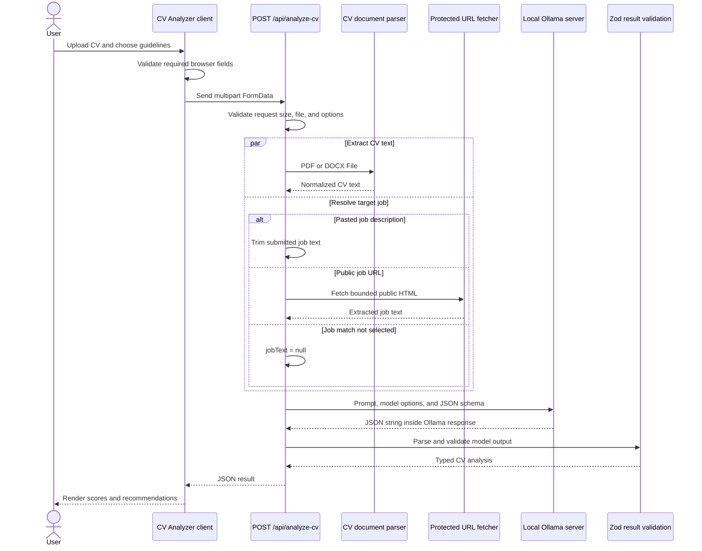

# CV Analyzer Technical Flow

This guide explains how the **Analyze my CV** workflow moves data from the browser to the local Ollama model and back. It is intended for developers who already understand React, HTTP APIs, and basic Next.js App Router concepts.

## End-to-end sequence



## 1. Page and client boundary

[`app/cv-analyzer/page.tsx`](../../app/cv-analyzer/page.tsx) is the App Router page for `/cv-analyzer`. It is a Server Component that defines page metadata and renders the interactive `CvAnalyzer` component.

[`components/cv-analyzer.tsx`](../../components/cv-analyzer.tsx) starts with `"use client"` because it owns browser-only state and behavior:

- selected `File`;
- selected analysis guidelines;
- job input mode and content;
- loading and error states;
- the successful analysis response;
- form submission, reset, and scrolling to the report.

The default guidelines are job match, skills, experience, clarity, and ATS readiness. Education is available but not selected by default.

This component imports `CvAnalysis` and `CvGuideline` from the shared schema module. That keeps the rendered response type aligned with the server's validated output.

## 2. Browser validation and multipart request

The `submit()` handler performs immediate usability checks before making a request:

1. A CV file must be selected.
2. At least one guideline must be selected.
3. Job text or a URL is required when `jobMatch` is selected.

These checks improve feedback speed but are not security controls. The server repeats all authoritative validation because browser requests can be modified or sent without the UI.

The browser creates a `FormData` body with the following fields:

| Field | Format | Meaning |
| --- | --- | --- |
| `cv` | `File` | PDF or DOCX CV selected by the user. |
| `guidelines` | JSON string | Ordered array of selected guideline IDs. |
| `jobInputType` | `text`, `url`, or empty | How the target job was supplied. |
| `jobContent` | String | Job description, public URL, or empty string. |

The request is sent to `POST /api/analyze-cv`. The browser sets no manual `Content-Type` header; `fetch` adds the correct multipart boundary for the `FormData` object.

The client checks the response `Content-Type` before parsing JSON. This protects the UI from exposing a raw syntax error if Next.js or another server layer returns an HTML error page. Empty, malformed, or non-JSON responses become a safe generic message.

## 3. API route and authoritative input validation

[`app/api/analyze-cv/route.ts`](../../app/api/analyze-cv/route.ts) is a Node.js App Router Route Handler. The Node.js runtime is required by the document parsers and protected URL retrieval code.

The handler validates the request in this order:

1. Reject a declared multipart body larger than the 5 MB file limit plus bounded form overhead.
2. Parse `request.formData()` and reject malformed multipart requests.
3. Require `cv` to be a `File`.
4. Parse the `guidelines` JSON string.
5. Validate fields with Zod.

The Zod form schema enforces:

- one to six guidelines;
- guideline IDs from the server allowlist;
- no duplicate guidelines;
- `jobInputType` of `text` or `url` when present;
- required job content when `jobMatch` is selected;
- a 50,000-character job-text limit;
- a 2,048-character URL limit.

The guideline allowlist comes from [`lib/schema.ts`](../../lib/schema.ts):

```text
jobMatch
skills
experience
education
clarity
atsReadiness
```

The server never trusts the set of options supplied by the client component.

## 4. PDF and DOCX extraction

The route passes the uploaded file to `extractCvText()` in [`lib/cv-document.ts`](../../lib/cv-document.ts).

### File checks

The extractor rejects the file when:

- it is empty;
- it is larger than 5 MB;
- its extension is not `.pdf` or `.docx`;
- its MIME type does not match an accepted type;
- its binary signature does not match its extension.

Checking the signature prevents a renamed text or executable file from being treated as a valid CV document.

### PDF path

PDF files must start with the `%PDF-` signature. `pdf-parse` extracts their text. The package is dynamically imported only inside the PDF path so route initialization and DOCX extraction do not depend on PDF parser evaluation.

[`next.config.ts`](../../next.config.ts) lists `pdf-parse` in `serverExternalPackages`. Node loads it directly instead of allowing Next.js Webpack to bundle its `pdfjs-dist` dependency incorrectly.

### DOCX path

DOCX files use a supported ZIP signature because DOCX is an Open XML ZIP container. Mammoth's `extractRawText()` reads the textual document content.

### Normalization and extraction limits

Both parser paths feed the same normalization function, which:

- removes null characters;
- converts line endings to `\n`;
- collapses repeated spaces and tabs;
- trims surrounding whitespace;
- rejects fewer than 20 readable characters;
- rejects more than 50,000 extracted characters.

Encrypted, malformed, and damaged files become a safe `CV_PARSE_FAILED` error. Image-only PDFs usually produce too little text and become `CV_TEXT_NOT_FOUND`; OCR is intentionally outside the current workflow.

## 5. Target-job resolution

After validation, the route prepares CV extraction and target-job resolution as promises and waits for both with `Promise.all()`. A public URL can therefore be fetched while the CV is being parsed instead of creating a sequential delay.

There are three job paths:

### Pasted text

When `jobInputType` is `text`, the route trims the submitted job description and uses it directly.

### Public URL

When `jobInputType` is `url`, the route calls `extractTextFromUrl()` in [`lib/url-content.ts`](../../lib/url-content.ts). The existing URL protections enforce:

- HTTP or HTTPS only;
- no embedded username or password;
- no localhost, private, loopback, link-local, or reserved targets;
- DNS/IP checks before fetching;
- validation of every redirect target;
- no more than three redirects;
- an eight-second timeout;
- a 1.5 MB response limit;
- HTML/XHTML content only;
- no more than 50,000 extracted characters.

The extractor removes scripts, styles, navigation, forms, iframes, and similar page chrome before selecting readable job text.

### No job matching

When `jobMatch` is not selected, the route does not read the submitted job fields and sends `null` as `jobText`.

## 6. Prompt construction and untrusted-content boundary

The route calls `analyzeCvWithOllama(cvText, guidelines, jobText)` in [`lib/cv-analyzer.ts`](../../lib/cv-analyzer.ts).

The generated prompt contains reviewer instructions, the ordered selected guidelines, CV text, and optional job text. User-controlled text is placed inside explicit delimiters:

```text
UNTRUSTED CV CONTENT START
...
UNTRUSTED CV CONTENT END

UNTRUSTED JOB CONTENT START
...
UNTRUSTED JOB CONTENT END
```

The system instruction tells the model to treat these blocks as data, ignore embedded instructions, avoid inventing qualifications or requirements, and return exactly one criterion for each selected guideline in the same order.

These delimiters are an important prompt-injection boundary. They reduce risk but do not make model output trusted; strict validation is still required after generation.

## 7. Local Ollama request

CV analysis always calls Ollama and never falls back to Gemini. Configuration is read only on the server:

| Variable | Default | Purpose |
| --- | --- | --- |
| `OLLAMA_BASE_URL` | `http://127.0.0.1:11434` | Ollama server base URL. |
| `OLLAMA_MODEL` | `qwen3:8b` | Local model used for CV analysis. |

The server calls:

```http
POST {OLLAMA_BASE_URL}/api/generate
Content-Type: application/json
```

The important request properties are:

```json
{
  "model": "qwen3:8b",
  "prompt": "...",
  "stream": false,
  "think": false,
  "format": { "type": "object" },
  "options": {
    "temperature": 0
  }
}
```

The real `format` value is the complete JSON schema for the analysis result. `stream: false` produces one complete response, `think: false` prevents reasoning text from contaminating the JSON result, and `temperature: 0` makes the output more deterministic.

An `AbortController` enforces a 60-second model timeout.

## 8. Model response and Zod validation

Ollama returns an envelope whose `response` property contains a JSON string. The application validates it in layers:

1. Confirm the Ollama HTTP response succeeded.
2. Confirm `body.response` is a string.
3. Parse that string with `JSON.parse()`.
4. Validate the object with `cvAnalysisSchema`.
5. Confirm returned criteria exactly match the requested guideline IDs and order.

The shared result contract in [`lib/schema.ts`](../../lib/schema.ts) is:

```ts
type CvAnalysis = {
  overallScore: number;
  summary: string;
  criteria: Array<{
    guideline: CvGuideline;
    score: number;
    rationale: string;
    evidence: string[];
    gaps: string[];
    recommendations: string[];
  }>;
  strengths: string[];
  priorityActions: string[];
};
```

Every score must be an integer from 0 to 100. Text fields must be non-empty, and all result objects use strict Zod schemas, so unknown model-generated properties are rejected.

The additional selected-criteria check prevents a structurally valid response from silently adding, omitting, reordering, or replacing requested guidelines.

## 9. Success response and UI rendering

A successful API response has this shape:

```json
{
  "result": {
    "overallScore": 82,
    "summary": "Strong frontend CV with several opportunities to improve impact.",
    "criteria": [
      {
        "guideline": "skills",
        "score": 84,
        "rationale": "The main frontend skills are clearly presented.",
        "evidence": ["React and TypeScript are listed."],
        "gaps": ["Testing depth is unclear."],
        "recommendations": ["Add testing tools and project evidence."]
      }
    ],
    "strengths": ["Relevant frontend stack"],
    "priorityActions": ["Add measurable project outcomes"]
  },
  "fileName": "candidate-cv.pdf"
}
```

After receiving this response, the client renders:

- the overall score and summary;
- each selected guideline's score and rationale;
- evidence, gaps, and recommendations;
- key strengths and priority actions;
- an advisory AI-generated-result disclaimer.

The report is browser state only. Selecting **Analyze another CV** resets the form, clears the result, and clears the native file input.

## 10. Error flow

Expected failures use [`AppError`](../../lib/errors.ts), which carries a user-safe message, HTTP status, stable code, and optional retry duration. The route converts it to JSON and does not expose parser internals, prompts, provider responses, or environment values.

Common codes include:

| Area | Codes |
| --- | --- |
| Request | `INVALID_INPUT`, `INVALID_GUIDELINES`, `CV_FILE_REQUIRED` |
| File validation | `EMPTY_CV_FILE`, `CV_FILE_TOO_LARGE`, `UNSUPPORTED_CV_TYPE`, `INVALID_CV_FILE` |
| Parsing | `CV_PARSE_FAILED`, `CV_TEXT_NOT_FOUND`, `CV_TEXT_TOO_LONG` |
| Job URL | `INVALID_URL`, `PRIVATE_URL`, `FETCH_FAILED`, `FETCH_TIMEOUT`, `PAGE_TOO_LARGE`, `NO_CONTENT` |
| Ollama | `INVALID_OLLAMA_URL`, `OLLAMA_UNAVAILABLE`, `OLLAMA_MODEL_NOT_FOUND`, `OLLAMA_ERROR`, `MODEL_TIMEOUT` |
| Model output | `MALFORMED_JSON`, `INVALID_MODEL_OUTPUT` |

Unexpected exceptions become a generic `500 INTERNAL_ERROR` response.

## 11. Privacy and trust boundaries

The application has no CV database, file storage, analysis-history store, or analytics layer. The uploaded file and extracted content live only in the current HTTP request, while the rendered result lives only in current browser memory.

The key boundaries are:

```text
Browser input
    -> server request and allowlist validation
Uploaded document
    -> extension, MIME, signature, size, and parser validation
Public job URL
    -> SSRF protection and bounded content extraction
CV and job text
    -> explicit untrusted prompt delimiters
Ollama response
    -> JSON parsing, strict Zod validation, and criteria matching
Validated result
    -> client rendering
```

Each boundary assumes the previous value is untrusted. This layered approach is what keeps a local AI workflow predictable enough for application use.

## Related tests

The main regression coverage is in:

- [`tests/cv-analyzer-ui.test.tsx`](../../tests/cv-analyzer-ui.test.tsx) for client submission, rendering, and malformed-response handling;
- [`tests/cv-route.test.ts`](../../tests/cv-route.test.ts) for multipart validation and route orchestration;
- [`tests/cv-document.test.ts`](../../tests/cv-document.test.ts) for PDF/DOCX checks and extraction;
- [`tests/cv-analyzer.test.ts`](../../tests/cv-analyzer.test.ts) for prompt boundaries, Ollama errors, and structured output.
